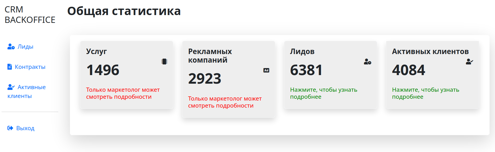

# CRM система для управления клиентами
___
## Главная страница от лица менеджера

___
# Основные используемые фреймворки и инструменты

* ### [Django](https://www.djangoproject.com/)
* ### [Celery](https://docs.celeryq.dev/en/stable/getting-started/introduction.html)
* ### [Postgres](https://www.postgresql.org/)
* ### [Redis](https://devdoc.net/database/redis-site-20210120/documentation.html)

## Основные функции приложения:
* авторизация пользователя;
* создание, редактирование и просмотр предоставляемых услуг;
* создание, редактирование и просмотр рекламной кампании;
* создание, редактирование и просмотр потенциальных клиентов;
* создание, редактирование и просмотр контракта для клиента;
* перевод потенциального клиента в активного;
* подсчёт и отображение статистики по рекламным кампаниям: сколько привлечено потенциальных клиентов, сколько из них перешло в активных.

## Роли пользователей
* Администратор может создавать, просматривать и редактировать пользователей, назначать им роли и разрешения. Такой функционал реализует административная панель Django.
* Оператор может создавать, просматривать и редактировать потенциальных клиентов.
* Маркетолог может создавать, просматривать и редактировать предоставляемые услуги и рекламные кампании.
* Менеджер может создавать, просматривать и редактировать контракты, смотреть потенциальных клиентов и переводить их в активных.
* Все роли могут смотреть статистику.

## Установка

* Убедитесь, что docker установлен на локальной машине ([Как установить Docker?](https://docs.docker.com/get-started/get-docker/))
* Склонируйте репозиторий на локальную машину
```sh
git clone https://github.com/XXSnape/crm.git
```

* Создайте файл .env co своими данными или скопируйте все из .env_template

* Запустите докер контейнер и подождите около 2 минут
```sh
docker compose up
```

* Сайт будет доступен по адресу http://127.0.0.1:8000/. Админ панель: http://127.0.0.1:8000/admin
###### При таком запуске суперпользователь и другие роли будут созданы автоматически в соответвии с данными из .env_template


## Данные в .env_template

#### HOST - Хост базы данных
#### PORT - Порт базы данных
#### POSTGRES_USER - Логин пользователя базы данных
#### POSTGRES_PASSWORD - Пароль пользователя базы данных
#### POSTGRES_DB - Название базы данных

#### REDIS_HOST - Хост для редиса

#### ADMIN_USERNAME - Логин админа
#### ADMIN_PASSWORD - Пароль админа

#### OPERATOR_USERNAME - Логин оператора
#### OPERATOR_PASSWORD - Пароль оператора
#### MARKETER_USERNAME - Логин маркетолога
#### MARKETER_PASSWORD - Пароль маркетолога
#### MANAGER_USERNAME - Логин менеджера
#### MANAGER_PASSWORD - Пароль менеджера
